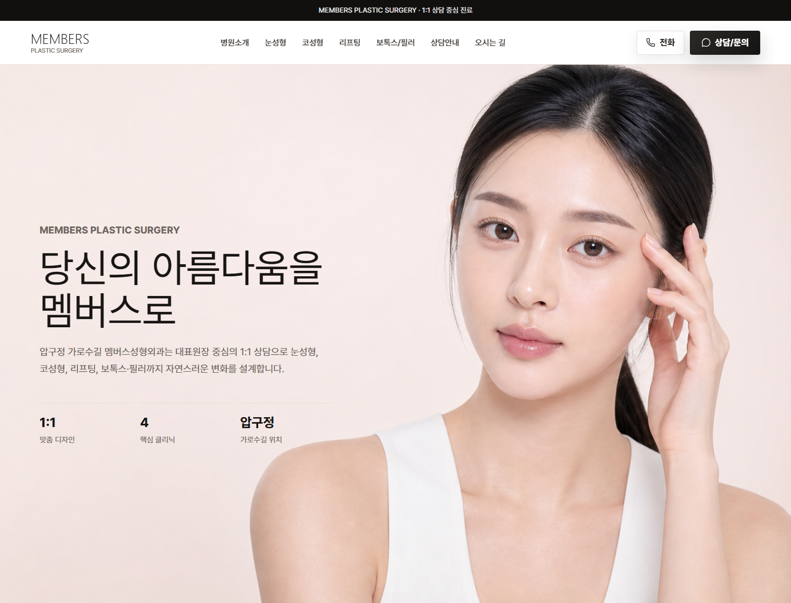
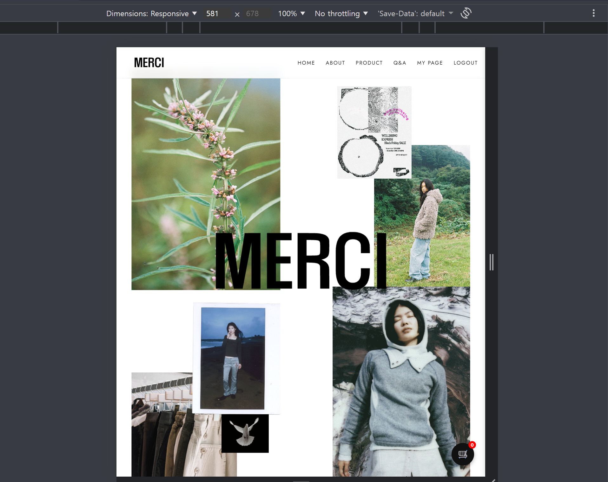
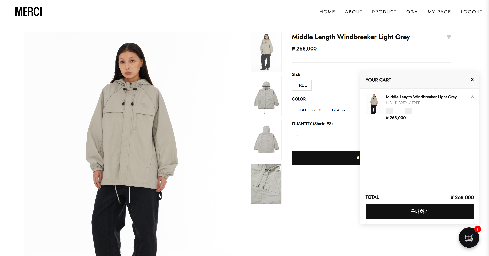
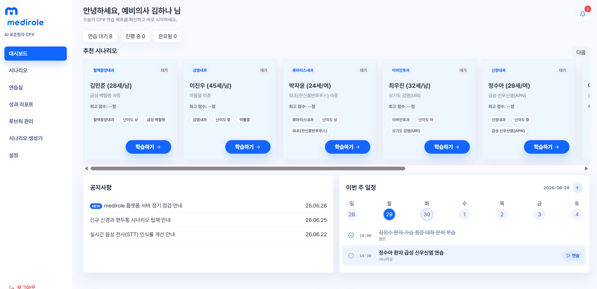
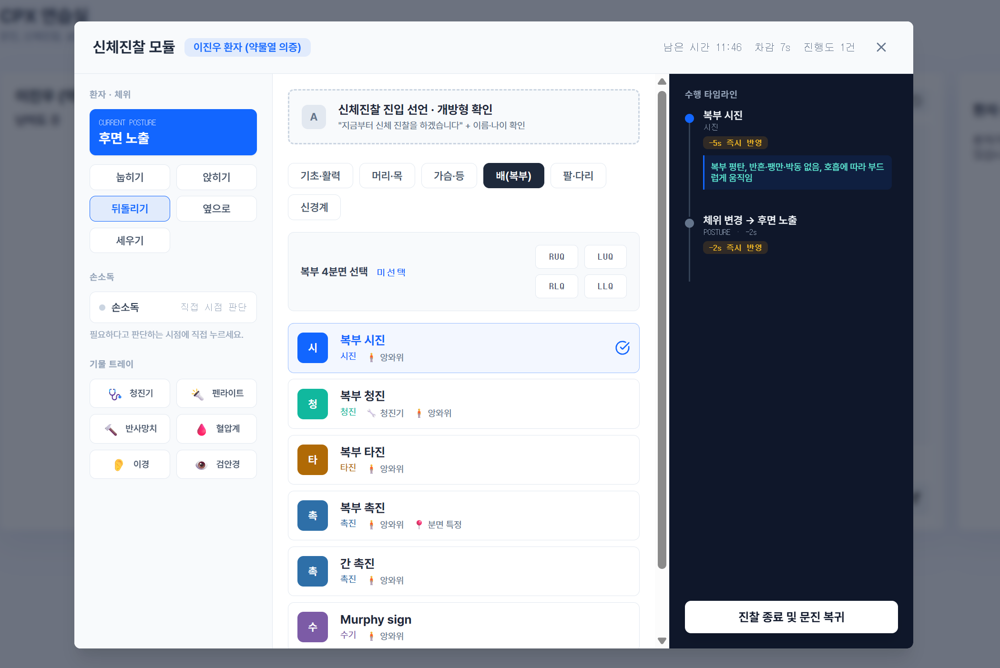
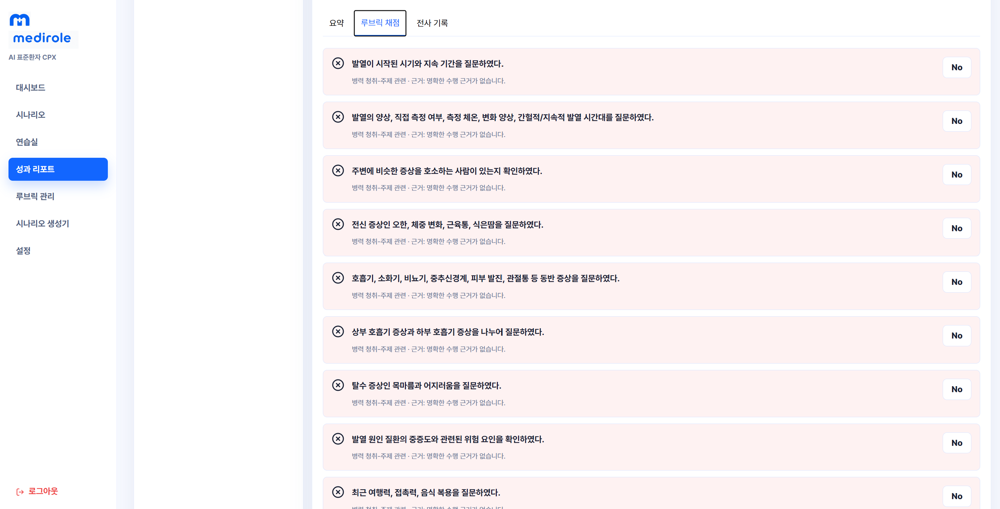
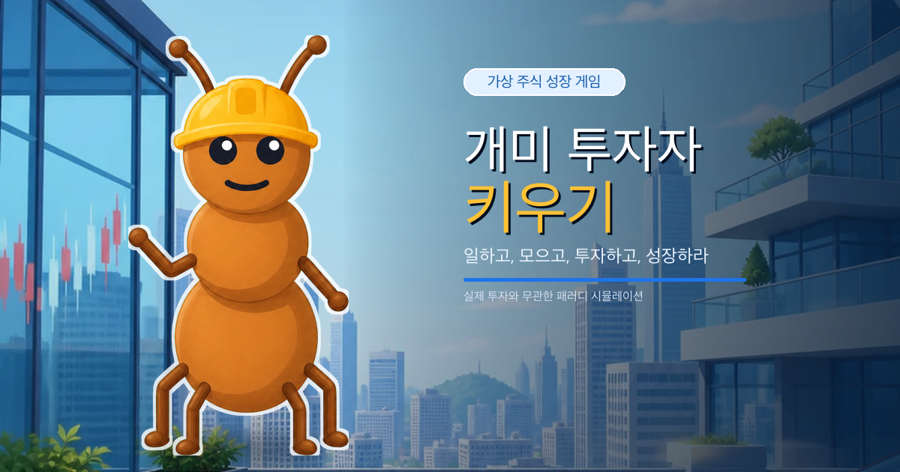
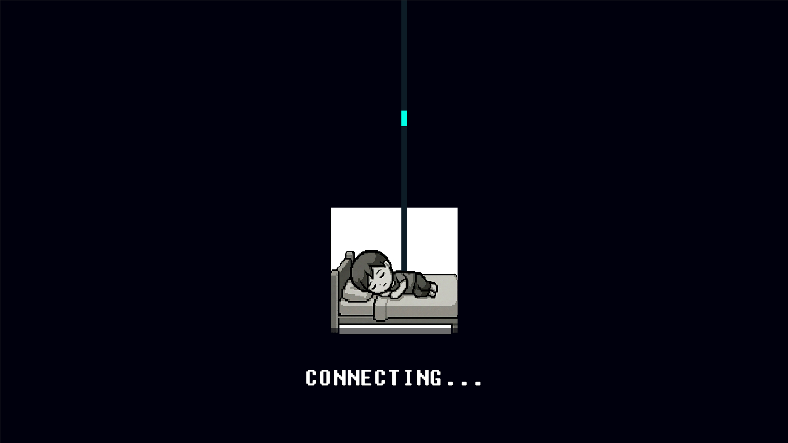
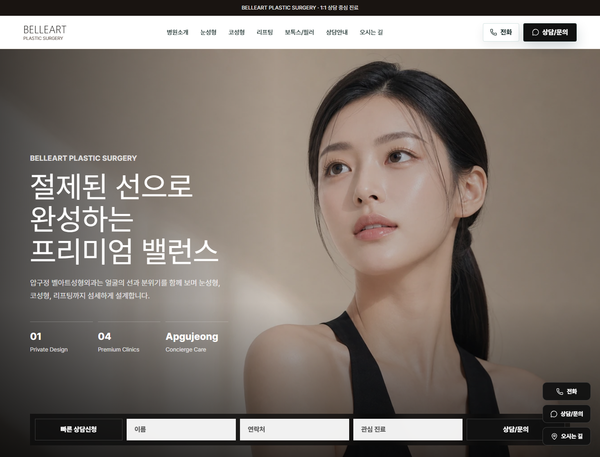

# 김태희 · TaeHui Kim

### 동작하지 않는 웹사이트를 고치려 시작해, 실제 서비스를 운영하고 제품화하는 개발자

경북대학교 글로벌소프트웨어융합전공 · 카카오테크캠퍼스 4기 
웹을 중심으로 병원 홈페이지, 생산성 도구, AI 교육 서비스, 게임과 모바일 앱을 직접 만들고 있습니다.

 

---

## 개발 여정

> Flash로 만들어져 제대로 동작하지 않던 병원 홈페이지를 보고 HTML·CSS·JavaScript를 배우기 시작했습니다. 
> 그 사이트를 직접 운영한 경험이 서버, 실시간 서비스, AI, 모바일과 네이티브 앱, 그리고 제품화까지 영역을 넓혀 온 출발점이 됐습니다.

| 단계 | 기술과 관점의 확장 | 대표 경험 |
| --- | --- | --- |
| **1. 시작** | HTML·CSS·JavaScript로 화면을 직접 만들고 배포 | Members Clinic 첫 운영 |
| **2. 기반** | JSP·Servlet·JDBC로 서버·세션·DB·트랜잭션 이해 | MERCI 최우수 평가·장학금 |
| **3. 확장** | FastAPI·WebSocket·Supabase·Gemini로 실시간 AI 서비스 구현 | MediCPX 해커톤 최우수상 |
| **4. 운영** | 저장 복구, 테스트, SEO, 멀티 배포와 운영 비용까지 설계 | 개미 투자자·시간모아·ReadmePDF |
| **5. 플랫폼** | React Native·Swift·Unity로 모바일·네이티브·게임에 도전 | Photo Sweep·Virtual Face Cam·게임 |
| **6. 제품화** | 개발·SEO·영업·제작 흐름을 반복 가능한 구조로 연결 | Clinic Website Productization |

처음에는 화면 하나를 고치는 일이 목표였지만, 지금은 **왜 이 기술이 필요한지 판단하고 배포 이후의 운영까지 책임지는 것**을 제품 개발의 기준으로 삼고 있습니다.

---

## Portfolio — 성장의 기록

> **CHAPTER 01 · 문제를 보고 개발을 시작하다** 
> 첫 프로젝트는 연습용 결과물이 아니라 실제 제안하고 제작해 수년간 운영한 병원 홈페이지였습니다.

### 1. 🏥 Members Clinic — 첫 웹사이트에서 Next.js 운영 서비스까지

1인 기획·개발·운영

  

- **HTML·CSS·JavaScript로 시작한 첫 운영 서비스** 
  Flash 기반 사이트가 제대로 동작하지 않는 모습을 보고 웹을 독학했습니다. 병원에 먼저 개선을 제안하고 기획, 디자인, 정보 수집, 개발과 배포를 맡아 실제 사이트로 운영했습니다.

- **운영 우선순위를 반영한 Next.js 재구축** 
  수년간 관리하며 복잡한 자체 예약 서버보다 검색 가능한 콘텐츠, 모바일 상담 접근성과 낮은 운영 복잡도가 먼저라는 점을 파악했습니다. 현재는 **Next.js 16 + React 19 프론트엔드 전용 구조**로 운영하고 상담은 카카오·전화 등 기존 채널로 연결합니다.

- **검색 가능한 콘텐츠와 상담 동선** 
  페이지별 메타데이터, sitemap, robots와 <code>MedicalClinic</code>·<code>FAQPage</code>·<code>BreadcrumbList</code> 구조화 데이터를 구성했습니다. 이미지에 묻혀 있던 시술 정보를 HTML 콘텐츠로 바꾸고 모바일 고정 CTA를 추가했습니다.

- **숫자로 확인한 재구축 효과** 
  동일 Lighthouse 데스크톱 프리셋에서 전송량을 **10,420KB → 2,567KB(약 75% 감소)**, SEO를 **92 → 100**으로 개선했습니다. 모바일 전송량도 <strong>8,270KB → 2,528KB(약 69% 감소)</strong>로 줄였고, 브랜드명 검색은 기존 3~4위권에서 최상단 노출을 확인했습니다.

- **운영시간 밖으로 넓어진 상담 접점** 
  고객이 늦은 시간에도 상담·예약 요청을 남길 수 있게 해 병원 운영시간에 묶여 있던 문의 흐름을 보완했습니다.

- **Spring으로 넓혀 본 백엔드 경험** 
  이후 Spring Boot 4·JPA·MySQL/H2로 예약, Q&A와 관리자 기능을 구현한 풀스택 프로토타입을 개발했습니다. 이 백엔드는 학습과 확장 경험이며 현재 **membersclinic.com** 운영 스택은 아닙니다.

  
  
  
  
  

---

> **CHAPTER 02 · 화면 뒤의 원리를 배우다** 
> 실제 사이트를 운영한 뒤에는 프레임워크가 가려 주는 서버·DB·트랜잭션의 흐름을 직접 구현하며 기반을 다졌습니다.

### 2. 🛍️ MERCI — JSP·Servlet 커머스

백엔드 기본기 · 전체 커머스 흐름

  

  
  

- **서버 사이드 웹의 기본기를 직접 구현** 
  JSP·Servlet·JDBC·MySQL과 Apache Commons DBCP를 사용해 요청, 세션, 인증, DB 반영까지의 흐름을 코드로 드러냈습니다. DAO가 주입받은 <code>Connection</code>을 사용하게 해 컨트롤러가 트랜잭션 경계를 제어하도록 구성했습니다.

- **주문·재고를 하나의 트랜잭션으로 보호** 
  주문 생성, 주문 항목 삽입과 재고 차감을 하나로 묶고 실패 시 rollback했습니다. <code>WHERE stock &gt;= ?</code> 조건으로 초과 판매도 차단했습니다.

- **인증·결제·운영 기능까지 연결** 
  PG 테스트 결제, 카카오 OAuth2, 상품·주문·Q&A 관리자 기능과 비동기 찜·장바구니를 구현하며 커머스의 전체 흐름을 경험했습니다.

- **구현 규모와 평가로 검증한 학습** 
  DAO 9개, 모델 10개, JSP 56개, 처리 컨트롤러 22개와 Java 2,127 LOC 규모로 완성했고, 프로젝트 **최우수 평가를 받아 장학금**을 수혜했습니다.

  
  
  
  
  
  

---

> **CHAPTER 03 · 실시간 서비스와 AI로 확장하다** 
> 서버의 기본기를 바탕으로 실시간 통신, 상태 설계와 구조화된 AI 응답을 하나의 교육 서비스로 연결했습니다.

### 3. 🩺 MediCPX — AI 표준화환자 플랫폼

실시간 문진 · 자동 채점

  

  
  

- **실제 CPX 조건을 반영한 실시간 문진** 
  FastAPI WebSocket으로 음성·텍스트 대화를 스트리밍하고, 학생이 정확히 질문하기 전에는 정보를 공개하지 않는 환자 상태를 설계했습니다. 실제 시험과 같은 **12분 제한**, 도구 선행 선택과 행동별 시간 차감도 구현했습니다.

- **40개 항목을 빠르게 채점하는 구조** 
  Gemini Structured Output이 근거 있는 Yes 항목만 반환하고 서버가 나머지를 복원하도록 해 응답량을 줄였습니다. Supabase는 데이터와 인증을 담당합니다.

- **대화부터 근거 기반 피드백까지 하나의 흐름으로** 
  진찰, 자동 채점과 리포트까지 완성해 **CODE-MEDI 해커톤 최우수상**을 받았습니다. 채점이 지연되거나 실패해도 대화 기록을 잃지 않는 복구 리포트를 제공합니다.

  
  
  
  
  
  
  

---

> **CHAPTER 04 · 만드는 것에서 배포하고 운영하는 것으로** 
> 기능 구현을 넘어 저장 복구, 테스트, 스토어 정책, 개인정보 보호와 검색 노출까지 제품의 일부로 다루기 시작했습니다.

### 4. 🐜 개미 투자자 키우기 — 멀티 배포형 투자 시뮬레이션

웹 운영 · 스토어 출시 준비

  

- **DOM 중심 금융 UI에 맞춘 ES Modules** 
  핵심이 3D·물리 연산보다 시세 계산, 매매, 카드·모달·차트였기 때문에 Unity나 무거운 프레임워크 대신 **Vanilla JavaScript + ES Modules**를 선택했습니다. 빌드리스 정적 구조는 PWA와 Android TWA로 이식하기도 쉬웠습니다.

- **깨지지 않는 저장과 방치 경제** 
  체크섬과 쓰기 후 검증이 있는 버전형 이중 슬롯 저장, 오래된 탭의 덮어쓰기 방지와 오프라인 보상 중복 정산 방어를 구현했습니다. 첫 시작, 출근 보상과 업그레이드는 저장 성공 뒤에만 화면 이펙트를 진행하도록 막았습니다.

- **계산과 렌더링의 속도를 분리** 
  가격 계산과 무거운 HUD 렌더 주기를 나누고, 가시 영역의 차트만 증분 갱신해 모바일에서도 불필요한 작업을 줄였습니다. 시작 화면은 승인된 캐릭터와 필수 튜토리얼 이미지를 먼저 디코드하고, 나머지 장면은 단계적으로 예열합니다.

- **스토어마다 다른 배포 계약을 코드로 분리** 
  Google Play-first <code>main</code>, ONE store 제출 브랜치와 Apps in Toss 프리뷰·제출 브랜치로 정책 경계를 나눴습니다. Vitest 394개, Playwright UI 140개, 전문 QA 4개와 프로덕션 검증기로 경제식, 저장 복구, 접근성, 반응형 UI와 금지 콘텐츠를 확인합니다.

- **실제 투자와 선을 긋는 운영 원칙** 
  투자 조언·도박·현금 보상과 무관한 엔터테인먼트임을 명시하고 실제 상장사와 무관한 가상 종목만 사용합니다.

  
  
  
  
  
  
  

### 5. 🗓️ 시간모아 — 로그인 없는 일정 조율 서비스

MVP

- **가입 없이 링크 하나로 시작하는 조율** 
  방을 만들고 링크를 공유하면 참여자가 로그인 없이 바로 응답하도록 전체 진입 흐름을 줄였습니다.

- **연속 가능한 시간을 계산하는 추천 로직** 
  30분·1시간 단위의 가능·애매함 응답을 모으고, 필요한 모임 길이만큼 연속 가능한 구간을 계산해 후보 1~3순위를 추천합니다.

- **브라우저와 DB 사이에 세운 서버 경계** 
  운영 데이터는 Supabase Postgres에 저장하지만 브라우저가 직접 접근하지 않고 Next.js 서버만 연결합니다. 방장·수정 토큰은 SHA-256 해시로 보관하고 90일이 지난 방은 접근을 막고 정리합니다.

- **설정 없이도 검증 가능한 저장소 분리** 
  로컬에서는 메모리 저장소, 운영에서는 Postgres를 사용해 방 생성 → 공유 → 응답 → 추천 → 확정 흐름을 환경과 무관하게 확인할 수 있게 했습니다.

  
  
  
  
  

### 6. 📄 ReadmePDF — 브라우저 로컬 문서 도구

운영 중

- **파일이 서버를 떠나지 않는 구조** 
  Next.js 정적 내보내기와 pdf-lib·JSZip을 사용해 Markdown 편집과 PDF 처리를 브라우저 안에서 끝냅니다. 회원가입, 데이터베이스와 PDF 변환 서버가 필요하지 않습니다.

- **브라우저 안에 모은 문서 작업 흐름** 
  GFM 실시간 미리보기, PDF 최대 20개 병합, 페이지 추출·ZIP, 페이지 번호와 이미지 최대 30장의 PDF 변환을 제공합니다.

- **4개 언어로 확장한 56개 검색 경로** 
  한국어·영어·일본어·스페인어 **14개 경로 × 4개 언어 = 56개 정적 URL**과 canonical·hreflang·다국어 sitemap을 구성했습니다.

- **배포 전 한 번에 확인하는 검증 게이트** 
  lint, typecheck, PDF 도구 검사, 빌드, 사이트와 정적 내보내기 검증을 release gate로 묶어 Cloudtype에 배포합니다.

  
  
  
  
  

---

> **CHAPTER 05 · 웹을 넘어 플랫폼을 넓히다** 
> 웹에서 쌓은 상태 설계와 배포 경험을 Unity, React Native, Python과 Swift로 옮기며 실행 환경의 경계를 넓혔습니다.

### 7. 💤 Free-Tier Sleep — 메타픽션 Unity 게임

12일 해커톤 · 팀 LastDance

  

- **12일 안에 두 장르를 연결한 팀 프로젝트** 
  정보 과잉과 AI 노동 착취를 무료 수면 요금제라는 블랙 코미디로 풀고, 수직 플랫포머와 탑다운 드로잉 디펜스를 하나의 이야기로 결합했습니다.

- **Phase 1의 클라이언트와 연출 담당** 
  인트로 씬 컨트롤러와 타이핑 효과, 케이블 데이터 흐름, <code>AdPopupManager</code> 광고 팝업 기믹과 <code>ProceduralAudioHelper</code> 오디오 연출을 구현했습니다.

- **역할을 나누며 배운 Unity 협업** 
  팀은 코요테 타임, 청크 기반 절차적 생성·오브젝트 풀링과 실시간 드로잉 방화벽을 구현했습니다. 제 역할과 팀 전체 구현을 구분해 기록합니다.

  
  

### 8. 🌙 기억을 싣는 밤열차 — 모바일 로그라이트 RPG

웹 프로토타입 · Unity 이식

- **웹에서 먼저 검증한 한 손 플레이** 
  Canvas와 Vanilla JavaScript·Vite로 세로 화면 드래그 이동, 자동 공격과 짧은 전투 루프를 빠르게 구현했습니다.

- **75초 안에 완결되는 전투와 성장** 
  3개 웨이브, 보스 패턴, 무적 질주, 광역 필살기와 **9종 스킬 3택**을 구성하고 승패·기억 조각·3단계 캐릭터 스토리를 로컬에 저장합니다.

- **검증된 프로토타입을 Unity로 확장** 
  Android AAB와 WebGL을 위해 Unity 6.3 LTS 런타임 부트스트랩을 만들고, Node 테스트와 프로덕션 빌드를 <code>npm run check</code>로 함께 확인합니다.

  
  
  
  

### 9. 🧹 Photo Sweep — 로컬 우선 사진 정리 앱

Android MVP

- **사진과 메타데이터를 서버에 보내지 않는 원칙** 
  Android 미디어 권한과 시스템 삭제 확인 흐름을 사용하기 위해 Expo React Native를 선택했습니다. 사진, 썸네일, EXIF와 향후 얼굴 임베딩은 기기 안에서 처리합니다.

- **실수를 줄이는 3단계 삭제 흐름** 
  최근 사진을 좌우 스와이프로 검토하고 삭제 후보를 대기열에 모은 뒤, 시스템 확인을 거쳐 최종 삭제합니다. 취소·실패 시에는 대기열을 보존합니다.

- **정리 목적에 맞춘 탐색 방식** 
  유사 사진, 스크린샷, 대용량과 오래된 사진 카테고리, 전체 미리보기와 웹 모의 모드를 제공합니다.

- **출시 기능과 실험 기능의 경계** 
  Android 11 이상 실제 기기 삭제 MVP와 typecheck·웹 export·Playwright E2E를 검증했습니다. 얼굴 그룹화는 출시 기능에 포함하지 않고 별도 온디바이스 과제로 분리했습니다.

  
  
  
  
  

### 10. 🎥 Virtual Face Cam — 크로스플랫폼 가상 카메라

오픈소스 · macOS 네이티브 도전

- **바로 사용할 수 있는 크로스플랫폼 버전** 
  Python과 OBS Virtual Camera를 연결해 Windows·macOS·Linux에서 이미지·폴더 선택, 1280×720 30fps 송출과 브라우저 제어 UI를 제공합니다.

- **OBS 없이 동작하는 macOS 네이티브 도전** 
  SwiftUI와 CoreMediaIO Camera Extension을 사용하고 App Group으로 host app과 extension이 이미지·설정을 공유하도록 설계했습니다.

- **코드로 확인 가능한 범위까지 검증** 
  Swift typecheck, plist·entitlements lint, XcodeGen 생성과 unsigned Debug build를 통과했습니다. 실제 signed System Extension 설치에는 유료 Apple Developer Team이 필요하다는 외부 조건을 명시했습니다.

- **정당한 사용 범위를 제품에 포함** 
  개발 테스트와 화상회의 용도만 안내하며 얼굴 인증, 시험 감독과 신원 확인 우회에 사용하지 않도록 경계를 두었습니다.

  
  
  
  

---

> **CHAPTER 06 · 경험을 반복 가능한 제품으로 만들다** 
> Members에서 시작한 병원 홈페이지 경험을 코드 한 벌이 아니라 디자인·SEO·영업·제작이 연결된 제품으로 확장하고 있습니다.

### 11. ✨ Clinic Website Productization — 병원 홈페이지 제품화 실험

템플릿 · 포트폴리오 · 영업 운영

  

- **Members 운영 경험에서 추출한 제품 원칙** 
  소개·상담형 병원 사이트에는 무거운 서버보다 검색 가능한 콘텐츠, 상담 CTA와 낮은 운영 부담이 중요하다는 판단을 템플릿의 기준으로 삼았습니다.

- **설정으로 브랜드를 바꾸는 정적 프론트 구조** 
  병원 정보와 콘텐츠를 데이터 파일에 모은 Next.js 템플릿으로 밝은 Members부터 다크 풀스크린 BELLEART까지 **6개 브랜드 테마**를 구현했습니다.

- **SEO와 영업을 개발 흐름에 연결** 
  <code>MedicalClinic</code>·<code>FAQPage</code>·Breadcrumb 구조화 데이터, SEO Automation, Portfolio Hub, Sales Kit와 Lead CRM을 함께 관리합니다.

- **외주를 반복 가능한 제작 시스템으로** 
  가격, 제안, 고객 접수, 포트폴리오 캡처와 제작 워크플로를 코드와 함께 묶어 매번 처음부터 시작하는 외주를 제품으로 바꾸는 실험을 진행하고 있습니다.

  
  
  
  

---

## Members 재구축 실측

같은 홈페이지를 동일한 Lighthouse 데스크톱 프리셋으로 측정한 재구축 전후 비교입니다.

| 지표 | 기존 HTML/CSS/JS | 현재 Next.js 운영 버전 | 변화 |
| --- | :---: | :---: | :---: |
| **총 전송 용량** | 10,420KB | **2,567KB** | **약 75% 감소** |
| **SEO** | 92 | **100** | **+8** |
| Best Practices | 100 | 100 | 유지 |
| Performance | **94** | 89 | −5 |
| LCP | **1.6초** | 2.2초 | +0.6초 |

**해석.** 재구축의 목표는 단순 속도 경신보다 검색 가능한 HTML 콘텐츠, 모바일 상담 동선과 유지보수성 확보였습니다. 이미지·콘텐츠 자산을 재정리해 전송량과 SEO를 개선했지만 첫 렌더 성능은 기존 정적 사이트보다 낮아졌습니다. 이 트레이드오프를 숨기지 않고 다음 최적화 기준으로 사용하고 있습니다.

※ 기존은 라이브, 재구축 버전은 로컬 프로덕션 빌드에서 측정했습니다. 전송량과 SEO는 구조적 비교에 사용하고, 지연 지표는 네트워크 조건 차이가 있어 참고값으로 봅니다.

---

## 기록하고 검증하는 방식

- 같은 Todo 앱을 **Vanilla JS + localStorage → React 19 + Vite → Next.js 16 + FastAPI + SQLAlchemy**로 세 번 다시 만들며 상태·컴포넌트·서버 경계를 비교했습니다.
- 카카오테크캠퍼스 학습은 GitHub 이슈에 **KPT 회고**로 기록하고 다음 주 구현에 반영합니다.
- 구현 결과를 동작만 확인하지 않고 직접 주석을 달고, 실패 로그와 수정 근거를 남깁니다.
- 프로젝트마다 기획안, 아키텍처, 트러블슈팅, 배포와 검증 기록을 정리하고 README를 현재 상태와 맞춥니다.

→ [kakaotech-learning-log](https://github.com/TaeHuiKKIM/kakaotech-learning-log)

## 관심 분야

- **제품 개발** — 실제 사용 흐름을 끝까지 구현하고 배포·운영하며 개선하는 일
- **투자·금융** — 투자 시뮬레이션, 핀테크와 데이터 기반 서비스
- **창업·수익화** — 웹 도구, 게임, 템플릿을 실제 유통 채널과 연결하는 과정
- **데이터 역량** — ADsP·SQLD 취득, 모의·실전투자대회 참가

## Tech Stack

| Area | Tools |
| --- | --- |
| **Web Product** |      |
| **Backend & Data** |   JSP/Servlet     |
| **Mobile & Game** |      |
| **Delivery & Test** |   Cloudtype   |

## Credentials & Activities

- **학점** GPA 4.18 / 4.3 · **TOEIC** 925 · **자격** ADsP, SQLD
- **CODE-MEDI 해커톤 최우수상** · 해달 해커톤 인기상 · 시흥 로컬 창업경진대회 장려상
- 백엔드 프로젝트 최우수 평가 **장학금** 수혜
- 카카오테크캠퍼스 4기 · IT 프로그래밍 동아리 해달

## Links

