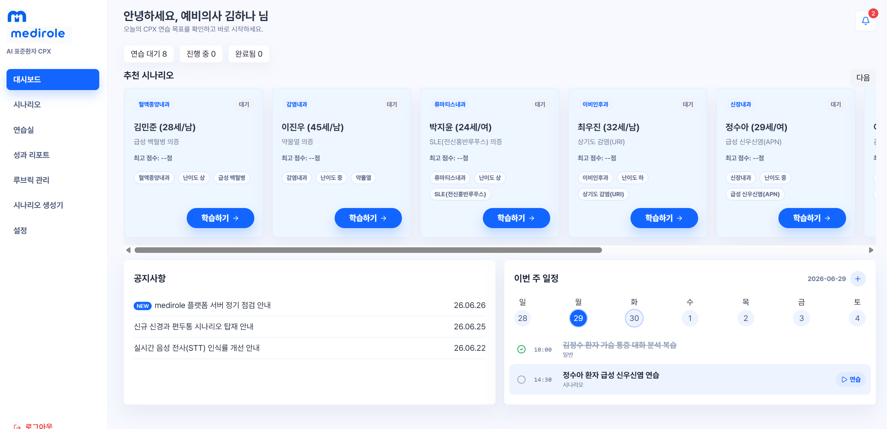
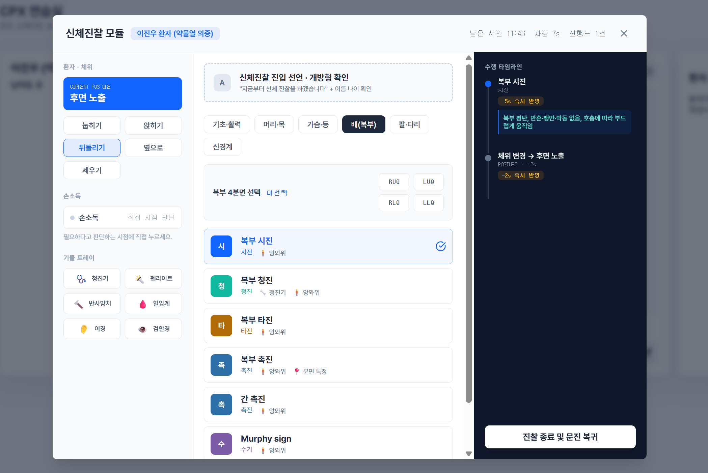
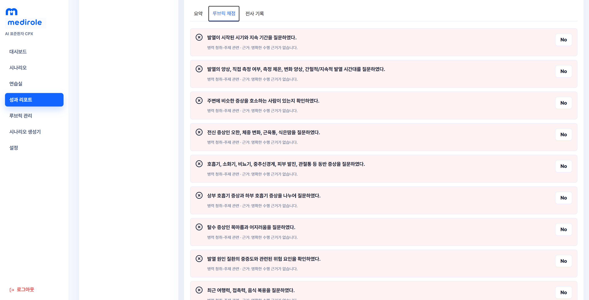
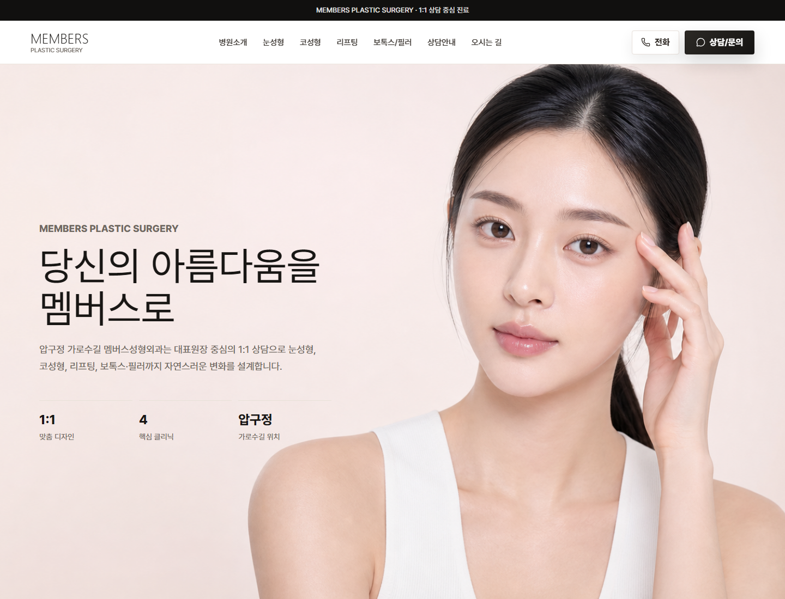
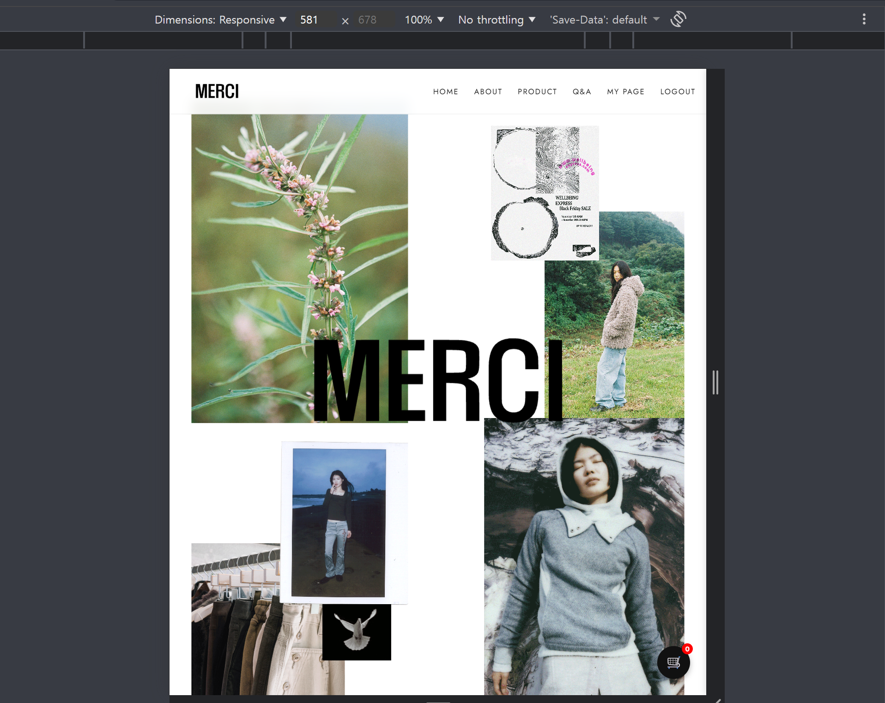
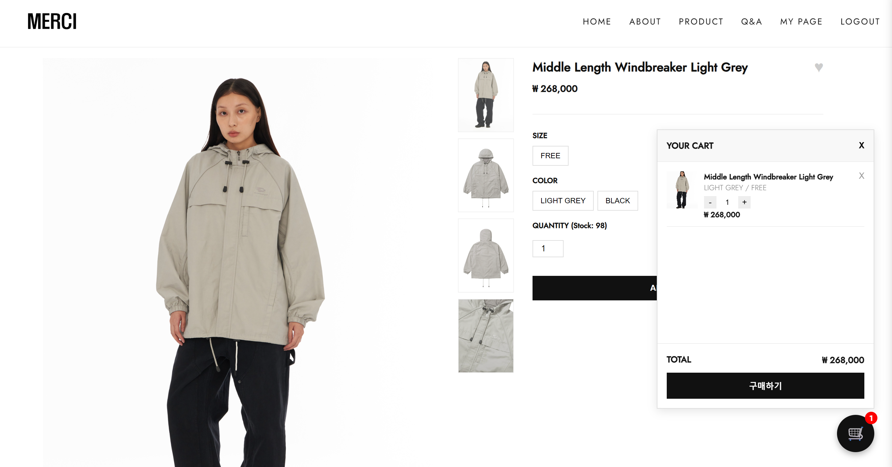

# 김태희 · TaeHui Kim

### AI를 실제 제품에 연결하고, 배포 이후의 운영까지 책임지는 Product · Backend Developer

경북대학교 글로벌소프트웨어융합전공 · 카카오테크캠퍼스 4기 
웹 서비스에서 시작해 백엔드, 실시간 AI, 모바일과 제품 운영으로 경험을 넓혀가고 있습니다.

 

---

## About Me

Flash로 만들어져 제대로 동작하지 않던 병원 홈페이지를 고치고 싶어 웹 개발을 시작했습니다.
직접 사이트를 제안하고 수년간 운영한 경험을 출발점으로 서버·DB·실시간 AI·모바일까지 영역을 넓혔습니다.

지금은 다음 세 가지를 개발의 기준으로 삼고 있습니다.

- **AI를 기능이 아니라 신뢰할 수 있는 제품 흐름으로 연결하기**
- **기술 선택의 이유와 트레이드오프를 수치와 기록으로 남기기**
- **구현에서 끝내지 않고 테스트·배포·운영까지 책임지기**

### Current Focus

- **2026 KB AI Challenge** — 비공개 금융 AI 팀 프로젝트 진행
- **카카오테크캠퍼스 Agentic AI** — Tool Call → Structured Output → SQLite → 출처별 RAG 학습
- **Python · FastAPI** — AI Product/Backend 역량과 코딩테스트 기반 강화
- **종합설계프로젝트 준비** — 평가 가능한 신뢰성 중심 Agentic AI 주제 탐색

---

# Projects

## 1. 🩺 MediCPX — AI 표준화환자 플랫폼

실시간 문진 · 자동 채점 · CODE-MEDI 해커톤 최우수상

  

  
  

- **FastAPI WebSocket으로 실시간 음성·텍스트 문진**을 구현했습니다.
- 학생이 정확히 질문하기 전에는 정보를 공개하지 않는 환자 상태와 **12분 시험 제한**을 설계했습니다.
- Gemini Structured Output이 근거 있는 항목을 반환하고 서버가 전체 **40개 체크리스트**를 복원하도록 구성했습니다.
- 채점이 지연되거나 실패해도 대화 기록을 잃지 않는 복구 리포트를 제공했습니다.

  
  
  
  
  
  

---

## 2. 🏥 Members Clinic — 첫 웹사이트에서 실제 운영 서비스까지

1인 기획·개발·운영 · Next.js 재구축

  

- Flash 기반 사이트를 보고 웹을 독학한 뒤 병원에 직접 개선을 제안해 **기획·디자인·개발·배포**를 맡았습니다.
- 운영 경험을 바탕으로 복잡한 예약 서버보다 검색 가능한 콘텐츠, 상담 접근성과 낮은 운영 복잡도를 우선했습니다.
- 메타데이터, sitemap, robots와 의료·FAQ·Breadcrumb 구조화 데이터를 적용했습니다.
- 동일 Lighthouse 데스크톱 프리셋에서 전송량을 **10,420KB → 2,567KB(약 75% 감소)**, SEO를 **92 → 100**으로 개선했습니다.

| 지표 | 기존 HTML/CSS/JS | Next.js 운영 버전 | 변화 |
| --- | :---: | :---: | :---: |
| 총 전송 용량 | 10,420KB | **2,567KB** | **약 75% 감소** |
| SEO | 92 | **100** | **+8** |
| Performance | **94** | 89 | −5 |
| LCP | **1.6초** | 2.2초 | +0.6초 |

성능 지표가 모두 좋아졌다고 과장하지 않고, 검색 가능한 콘텐츠와 유지보수성을 얻는 대신 첫 렌더 성능이 낮아진 트레이드오프도 다음 개선 기준으로 기록하고 있습니다.

  
  
  
  

---

## 3. 🛍️ MERCI — JSP·Servlet 커머스

백엔드 기본기 · 주문 트랜잭션 · 최우수 평가 및 장학금

  

  
  

- JSP·Servlet·JDBC·MySQL로 요청, 세션, 인증과 DB 반영 흐름을 직접 구현했습니다.
- 주문 생성, 주문 항목 삽입과 재고 차감을 하나의 트랜잭션으로 묶고 실패 시 rollback했습니다.
- `WHERE stock >= ?` 조건으로 초과 판매를 차단했습니다.
- PG 테스트 결제, 카카오 OAuth2, 상품·주문·Q&A 관리자 기능까지 커머스 흐름을 완성했습니다.
- DAO 9개, 모델 10개, JSP 56개, 처리 컨트롤러 22개와 Java 2,127 LOC 규모로 완성해 **최우수 평가와 장학금**을 받았습니다.

  
  
  
  

---

## 4. 🛡️ KB 안심보이스 · 머니룰 — 시니어 금융 Agentic AI

2026 KB AI Challenge · 팀 프로젝트 진행 중

- 시니어 사용자가 음성과 텍스트로 금융 업무를 요청할 수 있는 에이전트를 개발하고 있습니다.
- LLM은 의도 구조화와 설명을 담당하고, 실제 실행 가능 여부는 **결정론 규칙과 서버 코드**가 판단하도록 권한을 분리했습니다.
- 중요한 거래는 사용자가 확인한 규칙과 **일회용 승인 토큰**을 모두 검증한 뒤에만 실행되도록 설계했습니다.
- 외부 API 없이 재현하는 offline 모드와 실제 연동을 분리하고, 골든셋으로 안전 개입 단계를 평가하고 있습니다.

> 대회 진행 중인 비공개 프로젝트로, 제출 이후 공개 가능한 구현과 평가 결과를 업데이트할 예정입니다.

---

<strong>📦 More Products & Experiments — 추가 프로젝트 8개 펼쳐보기</strong>

 

| 프로젝트 | 문제와 구현 | 핵심 기술 · 결과 |
| --- | --- | --- |
| **🐜 개미 투자자 키우기** | 시세·매매·저장 복구가 있는 투자 시뮬레이션을 웹·스토어별 배포 계약으로 분리 | Vanilla JS, PWA, Android TWA, Vitest 394개, Playwright 140개 |
| **🗓️ 시간모아** | 로그인 없이 링크로 일정을 모으고 연속 가능한 시간을 추천 | Next.js, TypeScript, Supabase Postgres, SHA-256 토큰 |
| **📄 ReadmePDF** | 파일을 서버에 보내지 않고 브라우저에서 Markdown·PDF 처리 | Next.js Static Export, pdf-lib, JSZip, 4개 언어 56개 경로 |
| **💤 Free-Tier Sleep** | 12일 해커톤에서 두 장르를 연결한 메타픽션 게임 | Unity, C#, 인트로·팝업·절차적 오디오 담당 |
| **🌙 기억을 싣는 밤열차** | 75초 전투 루프를 웹에서 검증하고 Unity로 이식 | JavaScript Canvas, Vite, Unity 6.3 |
| **🧹 Photo Sweep** | 사진·EXIF를 서버에 보내지 않는 로컬 우선 Android 정리 앱 | Expo, React Native, TypeScript, 시스템 삭제 확인 |
| **🎥 Virtual Face Cam** | OBS 기반 크로스플랫폼 버전과 macOS 네이티브 카메라 확장 도전 | Python, SwiftUI, CoreMediaIO |
| **✨ Clinic Website Productization** | 병원 홈페이지 제작·SEO·영업 흐름을 반복 가능한 제품으로 구조화 | Next.js, 6개 테마, SEO Automation, Sales Kit |

### Links

- [개미 투자자 키우기](https://ant-idle-game.vercel.app)
- [ReadmePDF](https://web-readme-pdf-free-mrgf3o4gbe0b862a.sel3.cloudtype.app/)
- [기억을 싣는 밤열차](https://rpg-2d-sepia.vercel.app)
- [Virtual Face Cam](https://github.com/TaeHuiKKIM/virtual-face-cam)
- [Virtual Face Cam for macOS](https://github.com/TaeHuiKKIM/virtual-face-cam-mac)

---

## 기록하고 검증하는 방식

- 같은 Todo 앱을 **Vanilla JS + localStorage → React + Vite → Next.js + FastAPI + SQLAlchemy**로 다시 만들며 상태·컴포넌트·서버 경계를 비교했습니다.
- 카카오테크캠퍼스 학습은 GitHub Issue에 **주차별 회고와 리뷰 반영 과정**을 기록합니다.
- AI가 작성한 코드도 tool arguments, 저장 결과, 반환 계약과 경계 조건을 직접 실행해 확인합니다.
- 프로젝트마다 `docs/`에 기획, 아키텍처, 트러블슈팅과 검증 근거를 남기고 README를 현재 상태와 맞춥니다.

→ [kakaotech-learning-log](https://github.com/TaeHuiKKIM/kakaotech-learning-log)

## Tech Stack

| Area | Tools |
| --- | --- |
| **AI Product & Backend** | Python · FastAPI · LangChain · Structured Output · WebSocket · Java · Spring Boot |
| **Web Product** | TypeScript · React · Next.js · JavaScript · Tailwind CSS |
| **Data** | MySQL · PostgreSQL · SQLite · Supabase · ChromaDB |
| **Delivery & Test** | Docker · GitHub Actions · Vercel · Cloudtype · Vitest · Playwright · Pytest |
| **Other Platforms** | React Native · Expo · Unity · C# · SwiftUI |

## Credentials & Activities

- **GPA 4.21 / 4.3** · **TOEIC 925** · **ADsP** · **SQLD**
- **CODE-MEDI 해커톤 최우수상** · 해달 해커톤 인기상 · 시흥 로컬 창업경진대회 장려상
- 백엔드 프로젝트 최우수 평가 및 **장학금** 수혜
- 카카오테크캠퍼스 4기 · IT 프로그래밍 동아리 해달

## Links

