

# 김태희 · TaeHui Kim

### AI 제품을 만들고 운영하는 Product · Backend Developer

경북대학교 글로벌소프트웨어융합전공 · 카카오테크캠퍼스 4기 
웹 서비스에서 시작해 백엔드, 실시간 AI, 모바일과 제품 운영으로 경험을 넓혀가고 있습니다.

 

---

## About Me

Flash로 만들어져 제대로 동작하지 않던 병원 홈페이지를 고치고 싶어 웹 개발을 시작했습니다.
직접 사이트를 제안하고 수년간 운영한 경험을 출발점으로 서버·DB·실시간 AI·모바일까지 영역을 넓혔습니다.

지금은 다음 세 가지를 개발의 기준으로 삼고 있습니다.

- **AI를 기능이 아니라 신뢰할 수 있는 제품 흐름으로 연결하기**
- **기술 선택의 이유와 트레이드오프를 수치와 기록으로 남기기**
- **구현에서 끝내지 않고 테스트·배포·운영까지 책임지기**

### Current Focus

- **Antony Studio** · Apps in Toss 게임 출시·운영
- **Reqover** · Spring 요청별 실행 관계를 추적하는 오픈소스 도구
- **TUG GUARD** · 해양 시뮬레이션, 비전 학습 데이터, AI 추론 연동
- **Financial AI** · RiskTwin · KB 머니룰 기반 안심보이스
- **GROOVE Festival** · 현장 주막 운영 경험을 QR 주문·운영 백엔드로 연결

[출시 게임](#user-content-6--개미-투자자-키우기) · [의료 AI](#user-content-2--medirole--의료인의-cpx-대비를-위한-ai-표준화환자-플랫폼) · [Reqover](#user-content-8--reqover) · [TUG GUARD](#user-content-9--tug-guard) · [GROOVE](#user-content-groove-festival)

학습과 탐색

- **카카오테크캠퍼스 Agentic AI** — Tool Call → Structured Output → SQLite → 출처별 RAG 학습
- **Python · FastAPI** — AI Product/Backend 역량과 코딩테스트 기반 강화
- **종합설계프로젝트 준비** — 평가 가능한 신뢰성 중심 Agentic AI 주제 탐색

---

# Projects

## 1. 🏎️ AWS DeepRacer — Physical AI 경진대회 최우수상

강화학습 전략 · 보상 함수 · 실차 튜닝

  

- 학습·검증 병목을 줄이기 위해 가설 10개와 약 50개 모델을 병렬로 검증했습니다.
- 시뮬레이터 6초대의 좌표 기반 정책이 실차에서 이탈한 원인을 카메라 지연과
  전이되지 않는 위치 단서로 분석했습니다.
- 좌표를 버리고 중앙선 추종·워블 억제·±20도 조향과 구간별 속도 제어를 채택해
  **경북대 × 전남대 Physical AI 경진대회 최우수상**을 받았습니다.

---

## 2. 🩺 Medirole — 의료인의 CPX 대비를 위한 AI 표준화환자 플랫폼

실시간 문진 · 자동 채점 · CODE-MEDI 해커톤 최우수상

  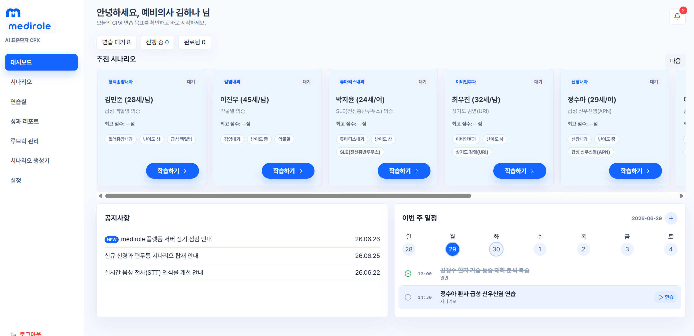

문진 화면과 평가 리포트

  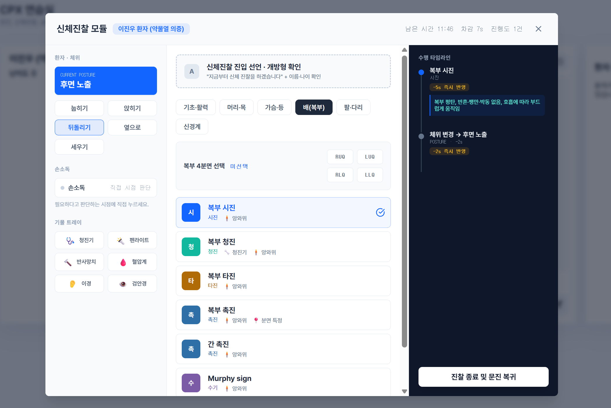

  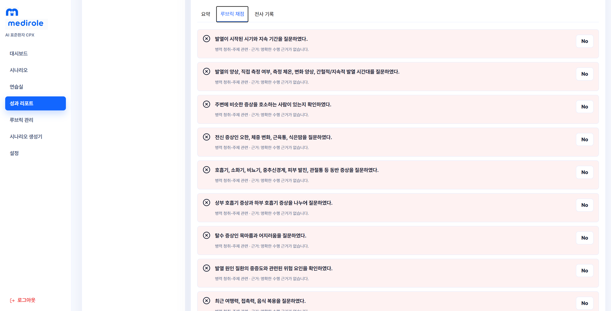

- **FastAPI WebSocket으로 실시간 음성·텍스트 문진**을 구현했습니다.
- 학생이 정확히 질문하기 전에는 정보를 공개하지 않는 환자 상태와 **12분 시험 제한**을 설계했습니다.
- Gemini Structured Output이 근거 있는 항목을 반환하고 서버가 전체 **40개 체크리스트**를 복원하도록 구성했습니다.
- 채점이 지연되거나 실패해도 대화 기록을 잃지 않는 복구 리포트를 제공했습니다.

  
  
  
  
  
  

---

## 3. 🏥 Members Clinic — 첫 웹사이트에서 실제 운영 서비스까지

1인 기획·개발·운영 · Next.js 재구축

  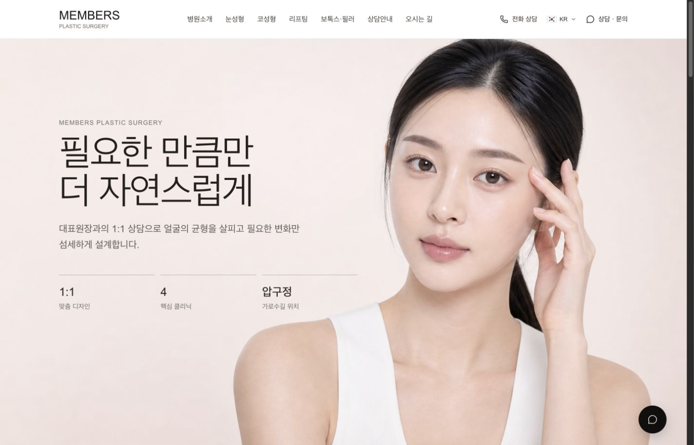

- Flash 기반 사이트를 보고 웹을 독학한 뒤 병원에 직접 개선을 제안해 **기획·디자인·개발·배포**를 맡았습니다.
- 운영 경험을 바탕으로 복잡한 예약 서버보다 검색 가능한 콘텐츠, 상담 접근성과 낮은 운영 복잡도를 우선했습니다.
- 메타데이터, sitemap, robots와 의료·FAQ·Breadcrumb 구조화 데이터를 적용했습니다.
- 동일 Lighthouse 데스크톱 프리셋에서 전송량을 **10,420KB → 2,567KB(약 75% 감소)**, SEO를 **92 → 100**으로 개선했습니다.

| 지표 | 기존 HTML/CSS/JS | Next.js 운영 버전 | 변화 |
| --- | :---: | :---: | :---: |
| 총 전송 용량 | 10,420KB | **2,567KB** | **약 75% 감소** |
| SEO | 92 | **100** | **+8** |
| Performance | **94** | 89 | −5 |
| LCP | **1.6초** | 2.2초 | +0.6초 |

검색 가능한 콘텐츠와 유지보수성을 중심으로 재구축하고, 전후 측정 결과를 다음 최적화의 기준으로 기록했습니다.

  
  
  
  

---

## 4. 🛍️ MERCI — JSP·Servlet 커머스

백엔드 기본기 · 주문 트랜잭션 · 최우수 평가 및 장학금

  

상품 상세와 주문 화면

  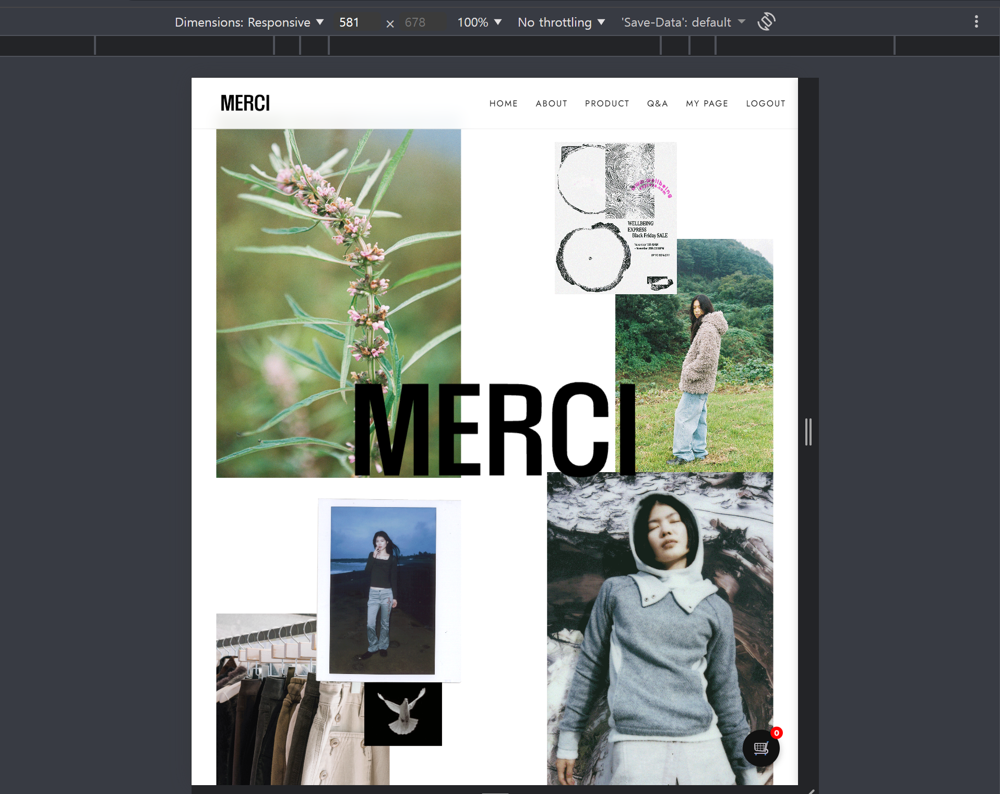

  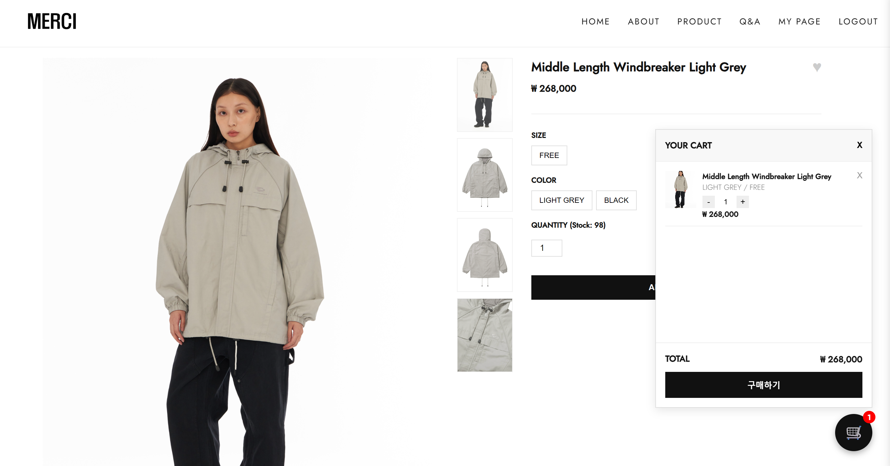

- JSP·Servlet·JDBC·MySQL로 요청, 세션, 인증과 DB 반영 흐름을 직접 구현했습니다.
- 주문 생성, 주문 항목 삽입과 재고 차감을 하나의 트랜잭션으로 묶고 실패 시 rollback했습니다.
- `WHERE stock >= ?` 조건으로 초과 판매를 차단했습니다.
- PG 테스트 결제, 카카오 OAuth2, 상품·주문·Q&A 관리자 기능까지 커머스 흐름을 완성했습니다.
- DAO 9개, 모델 10개, JSP 56개, 처리 컨트롤러 22개와 Java 2,127 LOC 규모로 완성해 **최우수 평가와 장학금**을 받았습니다.

  
  
  
  

---

## 5. 🛡️ KB 머니룰 기반 안심보이스 — 시니어 금융 Agentic AI

2026 KB AI Challenge · 팀 프로젝트 진행 중

  

- 시니어 사용자가 음성과 텍스트로 금융 업무를 요청할 수 있는 에이전트를 개발하고 있습니다.
- LLM은 의도 구조화와 설명을 담당하고, 실제 실행 가능 여부는 **결정론 규칙과 서버 코드**가 판단하도록 권한을 분리했습니다.
- 중요한 거래는 사용자가 확인한 규칙과 **일회용 승인 토큰**을 모두 검증한 뒤에만 실행되도록 설계했습니다.
- 외부 API 없이 재현하는 offline 모드와 실제 연동을 분리하고, 골든셋으로 안전 개입 단계를 평가하고 있습니다.

> [공개 저장소와 구현 기록](https://github.com/TaeHuiKKIM/kb-ansimvoice)

---

## 6. 🐜 개미 투자자 키우기

**Apps in Toss 출시·운영** · Antony Studio

가상 주식 매매와 방치형 성장을 연결한 게임입니다. 제품 기획부터 개발·아트 검수·출시·운영까지 맡았습니다.

2026.09.28 기준

누적 이용자 **10,336명** · D1 **52.8%** · D7 **30.3%** 
Threads **419,443회 조회** · 출시 초기 신규 게임·시뮬레이션 분야 **1위**

  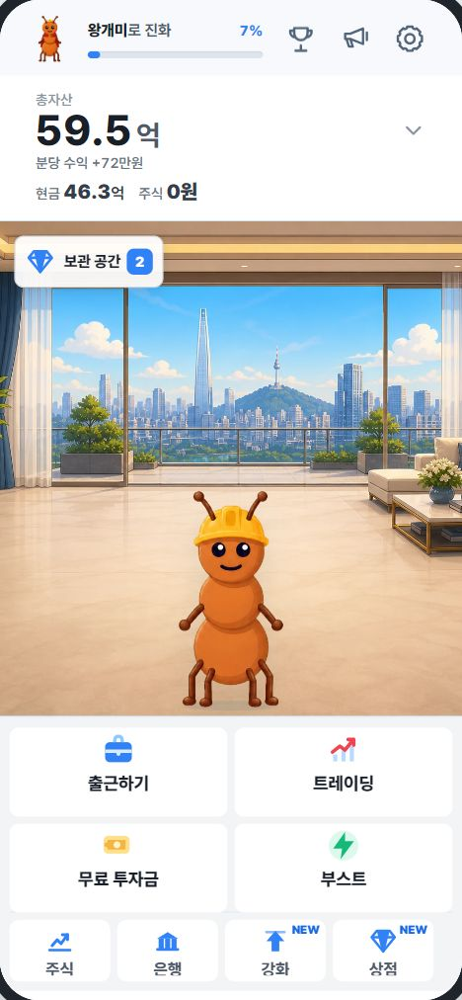&nbsp;&nbsp;&nbsp;&nbsp;
  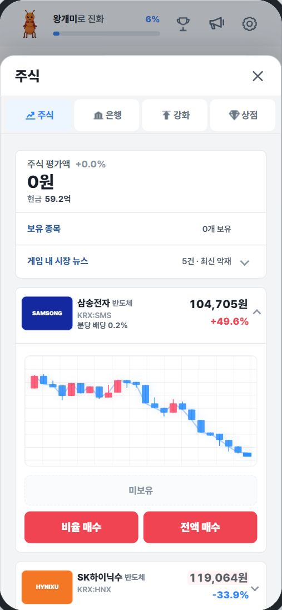

홈·성장 화면 &nbsp; / &nbsp; 가상 종목·매매 차트

- **플레이 흐름:** 매매·출근으로 재화를 모으고 개미 진화·집·수집품·꾸미기로 성장합니다.
- **개발:** 공통 웹 게임과 플랫폼별 어댑터, 자산 로딩과 저장·복구 흐름을 구현했습니다.
- **운영:** 사용자 반응을 확인하며 첫 실행·튜토리얼·화면 안정성을 개선했습니다.

[게임 보기](https://ant-idle-game.vercel.app/)

구현·운영 상세

- 튜토리얼 문장 중복 출력, 선택 이미지 로딩과 첫 플레이의 경합, PC·모바일 화면 충돌을 재현하고 수정·회귀검사 기록을 남겼습니다.
- HTML·CSS·JavaScript 공통 게임과 플랫폼별 어댑터를 분리하고, AI 생성 아트 후보를 실제 화면에서 검수해 최종 자산을 선정했습니다.

---

## 7. 💼 RiskTwin — 미래에셋 AI Festival 제출작

금융 AI 기획 · DART 공시 근거 · 다중 Agent 역할 설계

  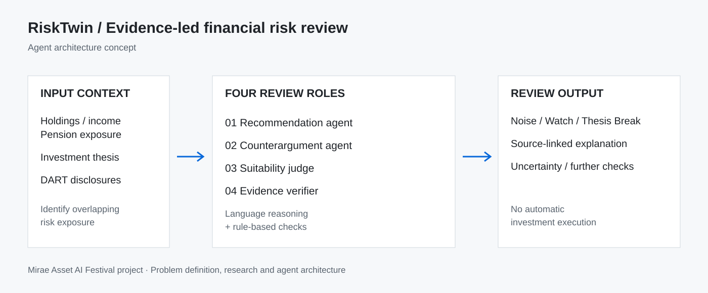

RiskTwin · Agent 설계 개념도

- 공시 요약을 넘어 **보유자산·소득·연금과 기업 위험의 겹침**을 설명하는 문제를 정의했습니다.
- 장기투자 콘텐츠 23개와 대표 사례 5개를 검토해 기존 공시 요약 서비스와의 차이를 정리했습니다.
- **추천·반대 검토·적합성 판단·근거 검증**의 4개 Agent 역할을 설계하고, 자연어 설명과 규칙 계산·원문 검증의 책임을 분리했습니다.
- 2026년 7월 미래에셋 AI Festival에 제출했으며, 문제 정의·조사·Agent 구조 설계를 맡았습니다.

---

## 8. 🔧 Reqover

**Spring 요청별 실행 관계 분석** · 2인 오픈소스 팀 · 핵심 MVP 설계·구현

“이 API 요청이 실제로 어떤 코드를 실행했는가?”를 확인하는 도구입니다. 메서드 실행 기록을 요청별로 모으고, 코드에서 관련 API를 역으로 찾습니다.

  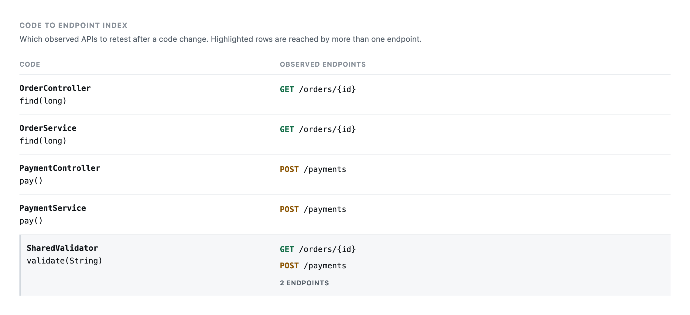

코드 → API 역방향 인덱스

- **내 구현:** 요청별 실행 bucket·probe 라우팅, ASM 계측, Java Agent 패키징과 리포트.
- **개발 결과:** API → 메서드 리포트와 코드 → API 역조회, 별도 JVM 에이전트 검증·데모.
- **팀의 확장:** MVC/WebFlux 연동을 개선하고 CLI·GitHub Action으로 재검증할 API 후보를 제시합니다.

[저장소](https://github.com/reqover-labs/reqover)

요청별 리포트와 구현 상세

  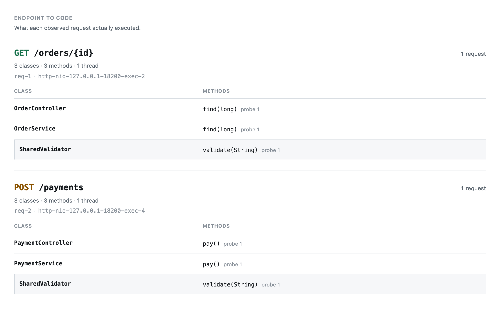

- **문제 정의:** 기존 커버리지 리포트로는 메서드가 실행됐다는 사실은 알 수 있어도 어떤 HTTP 요청이 실행했는지 알기 어려웠습니다. 요청 단위로 실행 관계를 기록하는 방향을 공동 설계했습니다.
- **내 구현:** 요청별 실행 bucket과 probe 라우팅, ASM 메서드 진입 계측, `-javaagent` 패키징, API → 메서드 리포트와 코드 → API 역방향 인덱스, 별도 JVM 에이전트 검증·데모를 만들었습니다.
- **팀의 확장:** Spring MVC/WebFlux 어댑터는 함께 개선했습니다. 팀은 JSON 내보내기와 CLI `render`·`diff`·`impact`, GitHub Action을 더해 변경 파일에서 다시 확인할 API 후보를 제시하는 흐름으로 확장했습니다.
- **검증 범위:** 메서드 진입과 실제 관측된 요청을 연결합니다. 줄·분기 커버리지를 측정하는 도구와 함께 사용할 수 있습니다.

---

## 9. ⚓ TUG GUARD

**해양 안전 디지털 트윈** · Three.js · 비전 학습 데이터 · FastAPI

예인 시나리오를 3D로 재현하고, 학습용 데이터 생성과 비전 모델 추론·위험 판단을 연결했습니다.

  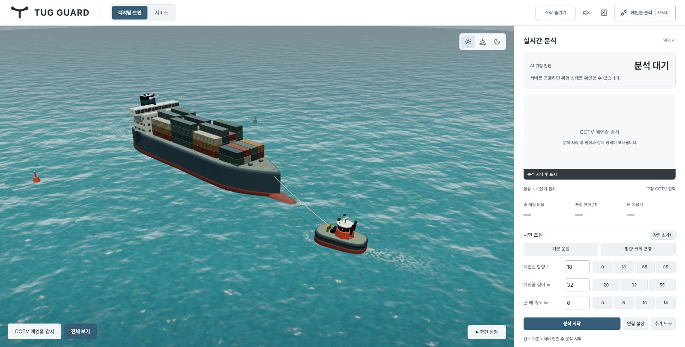

예인선·예인줄의 3D 장면과 시연 조작 패널

- **데이터 생성:** RGB 이미지·픽셀 마스크·YOLO-Seg 라벨을 렌더 지오메트리에서 생성.
- **동기화:** 공통 시뮬레이션 시계로 24 FPS 영상과 100 Hz 합성 IMU 기록.
- **추론·위험 판단:** 팀의 학습 모델을 연동하고 마스크 품질·줄 처짐 변화·횡경사를 함께 평가.

[저장소](https://github.com/ShipTugging/tugboat-safety-twin) · [시뮬레이터](https://tugboat-safety-twin.vercel.app/)

학습 데이터·추론 연동·검증 상세

- **시뮬레이터:** 본선·ASD 예인선·예인줄을 조작하는 Three.js 장면과 고정 CCTV 시점을 구현했습니다. 방향·줄 길이·속력·시간대를 바꿔 시나리오를 재현합니다.
- **내가 만든 학습 데이터 흐름:** 예인줄 Sag 단계와 시점·조명·해상 조건을 달리한 RGB 이미지, 픽셀 마스크, YOLO-Seg 폴리곤 라벨을 생성했습니다. 렌더 지오메트리로 정답을 만들고 가려진 줄은 마스크에서 제외했습니다.
- **멀티모달 기록:** 하나의 시뮬레이션 시계를 기준으로 24 FPS 영상과 100 Hz 합성 IMU를 기록하고 시각·프레임·센서값의 정합성을 검사했습니다.
- **AI 연동과 위험 판단:** 팀이 학습한 예인줄 분할 모델을 FastAPI 분석 서버에 연결했습니다. 예측 마스크의 품질, 줄 처짐 변화, 영상 각도와 IMU 횡경사를 시간에 따라 결합해 경보 상태를 계산했습니다.
- **검증:** 분할 라벨 변환·영상/IMU 동기화·서버 응답·경보 지속/회복 조건을 재현 가능한 시나리오와 테스트로 확인했습니다. 모델 학습·평가는 팀 작업이며, 실선 사고 데이터로 검증한 안전 인증 시스템은 아닙니다.

---

## 10. 🎪 GROOVE — 경북대학교 6단대 연합축제 플랫폼

**기획 참여 · 주막 지도·QR 주문 백엔드 개발** · 2026.10.01–10.02

IT·간호·예술·사회과학·사범·자연과학대학의 연합축제에 주막 지도, QR 주문, 가요제·이벤트·플레이리스트를 연결한 팀 웹서비스입니다. 저는 **주막 운영에서 발견한 병목을 주문·입금 확인 흐름과 Spring Boot 백엔드로 구체화**했습니다.

행사 대상 규모: 참여 6개 단과대학의 **학부 재학생 합계 8,937명**. 
경북대학교 2026 통계연보 · 2026.04.01 기준 · [단과대학별 학생 현황](https://ir.knu.ac.kr/state/report.php?isc_no=2081&isg_no=54)

  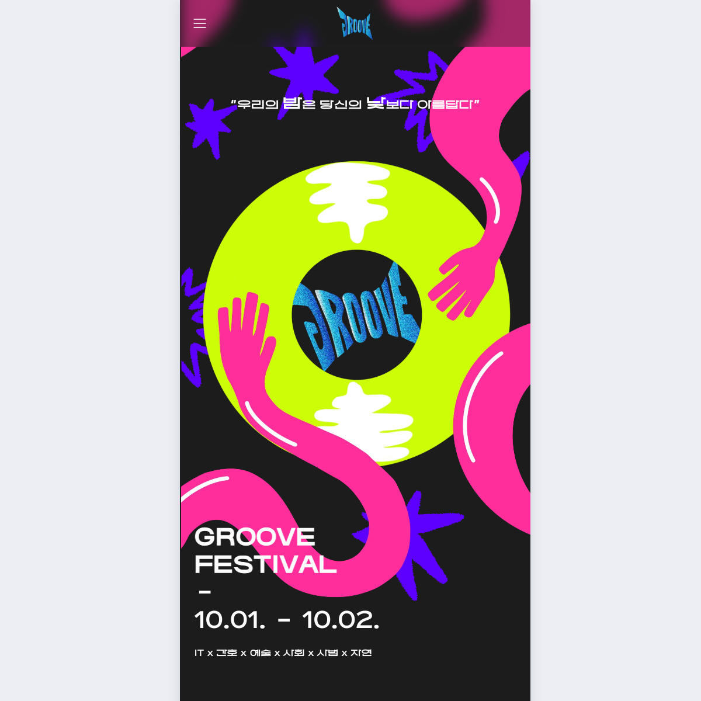

GROOVE 공개 웹 메인 · 2026.10.07 캡처

- **현장 운영:** 컴퓨터학부 주막 **39명 규모의 운영 인원과 **함께하며 메뉴·가격 책정, 매출관리, 고객 유입과 주방·서빙 동선을 함께 관리했습니다.
- **운영 설계:** 손님이 입금 화면을 반복해서 보여주고 직원이 테이블을 순회하던 병목을, **QR 주문 → 입금자명 제출 → 관리자 확인 → 조리·서빙**으로 연결해 한곳에서 확인하는 흐름으로 설계했습니다.
- **백엔드 구현:** 22개 주막 운영을 위한 지도·관리 API, 테이블 QR 식별, 서버 측 금액 계산과 주문 스냅샷을 구현했습니다. 멱등 키·유일 제약·잠금·조건부 갱신으로 **중복 주문과 승인·취소 상태 경합**을 다뤘습니다.
- **사업 감각:** 전적 대학에서 **3일간 총매출 약 1,700만 원의 주막 운영에 참여한 경험**을 메뉴·가격·주방·서빙 개선에 적용하고, 현장 요구사항을 서비스 개발과 연결했습니다.

[축제 웹사이트](https://chcse.knu.ac.kr/groove/) · [팀 프론트엔드 저장소](https://github.com/groove-festival/groove-client)

주문 정합성·운영 흐름·검증 상세

- **개인 기여:** 축제 웹사이트 기획 참여와 Spring Boot 주막 지도·QR 주문 API 개발입니다. 메인 화면을 포함한 프론트엔드는 팀 결과물입니다.
- **중복 방지:** 같은 멱등 키의 재요청에 최초 주문 결과를 재현하고, 메뉴명·단가·금액을 주문 당시 값으로 보관했습니다.
- **상태 정합성:** 입금자명 수정과 관리자 승인, 승인과 취소가 동시에 들어오는 상황을 상태 전이·조건부 UPDATE·비관적 락으로 처리했습니다. 실제 입금은 관리자가 확인하도록 역할을 분리했습니다.
- **검증 기록:** 병합 PR 기준 전체 35개 테스트와 주막 관련 통합·동시성 시나리오 19개 통과를 확인했습니다. 이번 README 작업에서 해당 테스트를 새로 실행한 것은 아닙니다.
- **수치 범위:** 8,937명은 참여 단과대학의 재학생 규모, 39명은 주막 운영 인원, 1,700만 원은 전적 대학 행사 총매출입니다. 서로 다른 경험과 실제 서비스 이용자 수를 합산하지 않습니다.

---

<strong>📦 More Products & Experiments — 추가 프로젝트 펼쳐보기</strong>

 

| 프로젝트 | 문제와 구현 | 핵심 기술 · 결과 |
| --- | --- | --- |
| **🧭 Agent SEO Kit** | 읽기 전용 SEO 점검·승인된 수정·근거 기반 재검증을 분리 | Codex·Claude Code Agent Skills |
| **🤖 카카오테크캠퍼스 팀 프로젝트** | 일정 Tool·구조화 요청·SQLite 기록·RAG 및 팀 프론트엔드 구현 | Python · TypeScript · Agentic AI |
| **🗓️ 시간모아** | 로그인 없이 링크로 일정을 모으고 연속 가능한 시간을 추천 | Next.js, TypeScript, Supabase Postgres, SHA-256 토큰 |
| **📄 ReadmePDF** | 파일을 서버에 보내지 않고 브라우저에서 Markdown·PDF 처리 | Next.js Static Export, pdf-lib, JSZip, 4개 언어 56개 경로 |
| **💤 Free-Tier Sleep** | 12일 해커톤에서 두 장르를 연결한 메타픽션 게임 | Unity, C#, 인트로·팝업·절차적 오디오 담당 |
| **🧹 Photo Sweep** | 사진·EXIF를 서버에 보내지 않는 로컬 우선 Android 정리 앱 | Expo, React Native, TypeScript, 시스템 삭제 확인 |
| **🎥 Virtual Face Cam** | OBS 기반 크로스플랫폼 버전과 macOS 네이티브 카메라 확장 도전 | Python, SwiftUI, CoreMediaIO |
| **✨ Clinic Website Productization** | 병원 홈페이지 제작·SEO·영업 흐름을 반복 가능한 제품으로 구조화 | Next.js, 6개 테마, SEO Automation, Sales Kit |

### Links

- [개미 투자자 키우기](https://ant-idle-game.vercel.app)
- [ReadmePDF](https://web-readme-pdf-free-mrgf3o4gbe0b862a.sel3.cloudtype.app/)
- [Virtual Face Cam](https://github.com/TaeHuiKKIM/virtual-face-cam)
- [Virtual Face Cam for macOS](https://github.com/TaeHuiKKIM/virtual-face-cam-mac)

---

## 기록하고 검증하는 방식

- 같은 Todo 앱을 **Vanilla JS + localStorage → React + Vite → Next.js + FastAPI + SQLAlchemy**로 다시 만들며 상태·컴포넌트·서버 경계를 비교했습니다.
- 카카오테크캠퍼스 학습은 GitHub Issue에 **주차별 회고와 리뷰 반영 과정**을 기록합니다.
- AI가 작성한 코드도 tool arguments, 저장 결과, 반환 계약과 경계 조건을 직접 실행해 확인합니다.
- 프로젝트마다 `docs/`에 기획, 아키텍처, 트러블슈팅과 검증 근거를 남기고 README를 현재 상태와 맞춥니다.

→ [kakaotech-learning-log](https://github.com/TaeHuiKKIM/kakaotech-learning-log)

## Tech Stack

| Area | Tools |
| --- | --- |
| **AI Product & Backend** | Python · FastAPI · LangChain · Structured Output · WebSocket · Java · Spring Boot |
| **Web Product** | TypeScript · React · Next.js · JavaScript · Tailwind CSS |
| **Data** | MySQL · PostgreSQL · SQLite · Supabase · ChromaDB |
| **Delivery & Test** | Docker · GitHub Actions · Vercel · Cloudtype · Vitest · Playwright · Pytest |
| **Other Platforms** | React Native · Expo · Unity · C# · SwiftUI |
| **3D & Vision** | Three.js · React Three Fiber · YOLO-Seg 학습 데이터 · 합성 비전/IMU |

## Credentials & Activities

### 🏆 Awards

  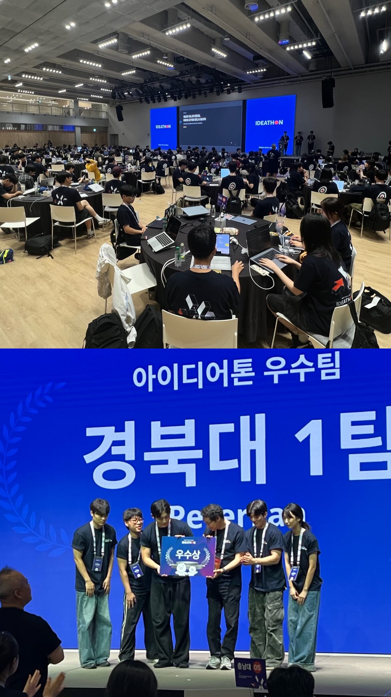

- **경북대 × 전남대 Physical AI 경진대회(AWS DeepRacer) 최우수상**
- **카카오테크캠퍼스 아이디어톤 우수상**
- **2026 CODE-MEDI 의료 AI·SW 융합 해커톤 최우수상** — 대한민국의학한림원 · 2026.06.29
- **2026 해달 해커톤 인기상** — 경북대학교 IT대학 학술동아리 해달 · 2026.06.09
- **2025 TU 소프트웨어 경진대회 장려상(교내 SW경진대회)** — 한국공학대학교 · 2025.11.19
- **2025 시흥실록지리지 장려상** — 학생주도형 지역문제 해결 프로젝트 · 한국공학대학교 창업교육센터 · 2025.12.05
- 백엔드 프로젝트 최우수 평가 및 **장학금** 수혜

### Credentials & Programs

- **GPA 4.21 / 4.3** · **TOEIC 925** · **ADsP** · **SQLD**
- 카카오테크캠퍼스 4기 · IT 프로그래밍 동아리 해달

## Links

